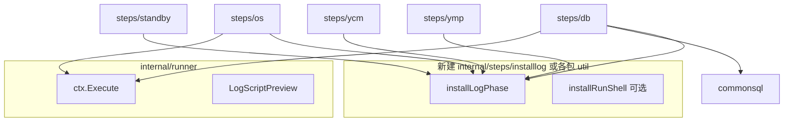

# 安装域（OS/DB/Standby/YCM/YMP）debug 日志对齐整改计划

**状态：已完成（2026-05-27）** — Phase 0～3 已落地：`LogPhase` / `RunShellScript` / `dbRunSQLPhase`、五域 `plan` 里程碑、commonsql 远端 `-f`、`make check-debug-logging`。

> 基准：`collect`（`collectLogPhase` + `runAndSave*` op 里程碑 + `collectRunShell/SQL`）与 `stressos`（`stressLogPhase` + `stressRunShell/FIO`）已落地的要求。  
> 规范已写入 [`.cursor/rules/yinstall-development.mdc`](../../.cursor/rules/yinstall-development.mdc)「日志」章节。

## 审计结论（2026-05）

| 域 | 步骤前缀 | 命令级 debug | 脚本预览 | 编排 phase | 总体 |
|----|----------|--------------|----------|------------|------|
| collect | R-* | 是（`collectExecute`） | 是 | 是 | **已对齐** |
| stressos | S-* | 是 | 是 | 是 | **已对齐** |
| os | B-* | 是（`ctx.Execute*`） | **否**（B-015 等多行 script 单行 `>>>`） | **否** | **部分满足** |
| db | C-* | 是 | SQL 有（`commonsql`） | **否** | **部分满足** |
| standby | E-* | 是 | 同 db | **否** | **部分满足** |
| ycm | G-* | 是 | 同 db | **否** | **部分满足** |
| ymp | H-* | 是 | 同 db | **否** | **部分满足** |

**已满足（无需重做）**

- `runner.StepContext.Execute` / `ExecuteWithCheck`：`LogCommandStart` / `LogCommandResult`。
- `commonos.ExecuteAsUser*`：委托 `ctx.Execute`，命令可追溯。
- `commonsql.ExecuteSQL*`：`LogScriptPreview("sql", ...)` + 经 ExecuteAsUser 打命令。
- `ssh.Upload` + `UploadContext`：上传起止与进度。
- 失败：`LogErrorExit` / `ReportSQLFailure` / `CommandExitLogged` 防重复。

**主要缺口**

1. **无结构化 `phase` 里程碑**：安装五步均缺 `plan` / 子任务 `*-start|*-done`，长步骤（C-021 部署、H-011 安装、B-020 磁盘）debug 只见离散 `>>>`，不知当前业务阶段。
2. **多行 shell 无正文预览**：典型 `internal/steps/os/b015_install_deps.go`（zstd 源码 `ExecuteWithCheck(script)`）；ymp/db 若新增类似模式会重复问题。
3. **批量操作无进度**：如 C-014 多节点 gen、C-025 多条 SQL、E-017 验证链、G-007 deploy——仅有 INFO 或命令日志，无统一 `phase`。
4. **INFO 与 phase 混用**：db 大量 `Logger.Info` 进 debug，有用但无法结构化检索 `phase=bench-start` 类关键字。

**不在本次整改范围**

- `clean` 子命令（破坏性清理，步骤少）。
- 改造 `commonsql` heredoc 为 collect 式临时文件（收益有限，可 Phase 3 评估）。
- collect/stressos 已完成功能的回退。

---

## 目标架构



推荐：**先**在 `internal/runner` 或 `internal/logging` 增加薄封装 `runner.LogPhase(ctx, phase, msg)`（与 collect/stress 实现相同），各域别名 `osLogPhase` → 委托 runner，避免五份复制粘贴。

---

## 分阶段整改

### Phase 0 — 基础设施（1 PR，阻塞后续）

| 项 | 内容 |
|----|------|
| P0-1 | `runner.LogPhase(ctx, phase, msg)`（或 `logging.LogPhase`） |
| P0-2 | `installRunShell(ctx, script, sudo, timeout)`：复制 `stressRunShell` 逻辑，供 os/ymp 源码安装等复用 |
| P0-3 | 规则与检查清单已写入 `yinstall-development.mdc`（本计划配套） |

验证：单元测试仅测 `LogPhase` 空实现；`go test ./...`。

### Phase 1 — 高噪音 / 高风险步骤（2～3 PR）

优先「步骤多、耗时长、多子命令」：

| 优先级 | 步骤 | 改动要点 |
|--------|------|----------|
| P1-os | B-015 | zstd 源码：`installRunShell` + `build-start/done` |
| P1-os | B-020 | 磁盘：`plan` + 每盘/每阶段 `op-*`（或 `disk-start`） |
| P1-db | C-021 | 部署：`plan`（clean/wipe/deploy）+ 各 yasboot 子阶段 phase |
| P1-db | C-020 | 安装软件：上传/解压/安装里程碑 |
| P1-db | C-014 | gen config：每节点/每命令类型 `plan` |
| P1-ymp | H-011 | 安装：大脚本改 `installRunShell` + phase |
| P1-ycm | G-007 | deploy：phase 链 |
| P1-standby | E-011～E-017 | 扩容主路径：`plan` + 关键 yasboot/SQL 节点 |

### Phase 2 — 域内扫尾（按包 1 PR）

| 包 | 范围 |
|----|------|
| os | 其余 B-*：Action 入口 `plan`（cmds=N）；无多行 script 可仅 op 级 |
| db | 其余 C-*：SQL 批量步骤（C-025/C-030/C-033）加 `query-*` 或 `sql-start` |
| standby | 其余 E-* |
| ycm | 其余 G-* |
| ymp | 其余 H-* |

### Phase 3 — 可选增强

- `commonsql`：可选远端 `.sql` 文件执行（与 collect 一致），减少 heredoc 在 debug 中的可读性。
- CI：grep 检查新增 `ExecuteWithCheck(\`set -e` 多行 script 且无 `LogScriptPreview`（允许列表除外）。
- 文档：`installer.md` 增加「排障读 debug」一节，列举 `phase=` 关键字。

---

## 验收标准

对任一整改步骤，`*_debug.log` 须同时满足：

1. 步骤开始有 `phase=plan`（或等价 `LogPhase`）。
2. 每个长耗时子操作前有语义化 `phase=*-start`（含产物/命令摘要，非完整 stdout）。
3. 子操作结束有 `*-done` 或 `*-fail`（含 exit/bytes/lines 或业务摘要）。
4. 多行脚本有 `script=shell >>> body`（`LogScriptPreview`）再出现 `>>> bash ...`。
5. 终端 session 无新增噪音（phase 仅 debug）。

集成抽查：

```bash
make build-current
./build/yinstall_* os -t 10.10.10.130 -s B-015 --os-build-zstd-from-source
./build/yinstall_* db -t 10.10.10.130 -s C-020,C-021 --dry-run=false  # 按环境最小集
grep -E 'phase=plan|phase=.*-start|script=shell' ~/.yinstall/logs/*_debug.log | tail -50
```

---

## 工作量粗估

| 阶段 | 人天（估） |
|------|-----------|
| Phase 0 | 0.5 |
| Phase 1 | 2～3 |
| Phase 2 | 2～4（与步骤数成正比） |
| Phase 3 | 1（可选） |

建议：**Phase 0 + P1 关键步骤** 先合并，Phase 2 按域迭代，避免单次超大 diff。
